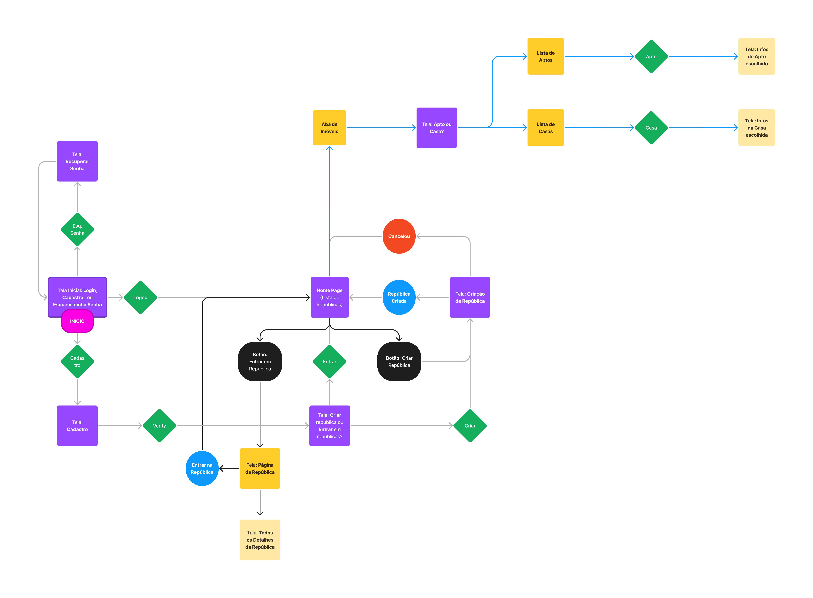
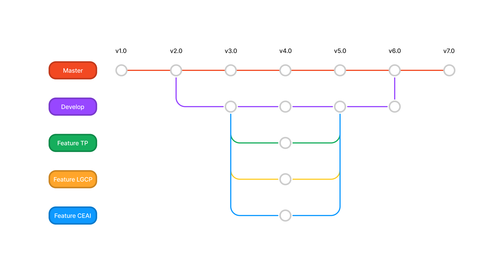
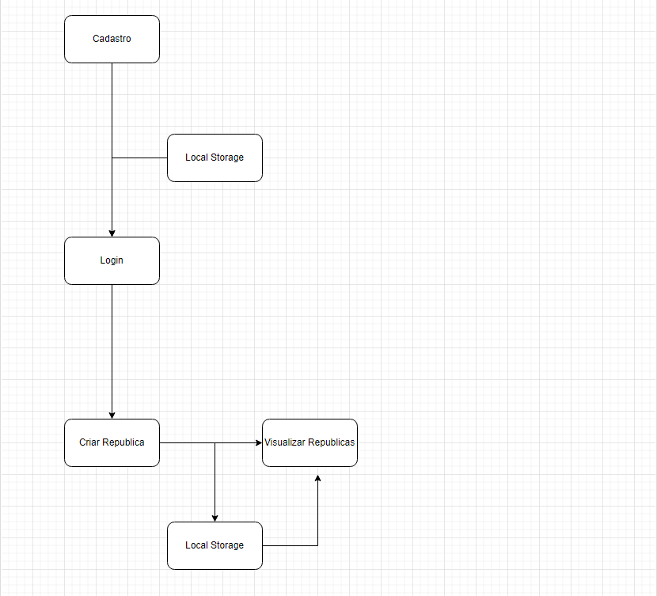

# Informações do Projeto
`TÍTULO DO PROJETO`  

RepApp - Achando republicas pra você!

`CURSO` 

Trabalho Interdisciplinar: Aplicações Web

## Participantes

- Carlos Emanuel Silva e Melo Oliveira
- Pedro Silva Gontijo
- Yan Rodrigues Nalon

# Estrutura do Documento

- [Informações do Projeto](#informações-do-projeto)
  - [Participantes](#participantes)
- [Estrutura do Documento](#estrutura-do-documento)
- [Introdução](#introdução)
  - [Problema](#problema)
  - [Objetivos](#objetivos)
  - [Justificativa](#justificativa)
  - [Público-Alvo](#público-alvo)
- [Especificações do Projeto](#especificações-do-projeto)
  - [Personas e Mapas de Empatia](#personas-e-mapas-de-empatia)
  - [Histórias de Usuários](#histórias-de-usuários)
  - [Requisitos](#requisitos)
    - [Requisitos Funcionais](#requisitos-funcionais)
    - [Requisitos não Funcionais](#requisitos-não-funcionais)
  - [Restrições](#restrições)
- [Projeto de Interface](#projeto-de-interface)
  - [User Flow](#user-flow)
  - [Wireframes](#wireframes)
- [Metodologia](#metodologia)
  - [Divisão de Papéis](#divisão-de-papéis)
  - [Ferramentas](#ferramentas)
  - [Controle de Versão](#controle-de-versão)
- [**############## SPRINT 1 ACABA AQUI #############**](#-sprint-1-acaba-aqui-)
- [Projeto da Solução](#projeto-da-solução)
  - [Tecnologias Utilizadas](#tecnologias-utilizadas)
  - [Arquitetura da solução](#arquitetura-da-solução)
- [Avaliação da Aplicação](#avaliação-da-aplicação)
  - [Plano de Testes](#plano-de-testes)
  - [Ferramentas de Testes (Opcional)](#ferramentas-de-testes-opcional)
  - [Registros de Testes](#registros-de-testes)
- [Referências](#referências)

# Introdução

## Problema

Ingressar em uma universidade é um grande evento na vida dos jovens e junto dele vem desafios que devem ser enfrentados pelos mesmos, dentre eles o mais problemático é mudar-se de cidade para estudar, e consequentemente, encontrar um novo lugar para morar sem ter grandes despesas. Achar repúblicas para morar não é algo fácil, principalmente para quem não tem nenhum meio social em um ambiente novo. É preciso ter contatos e procurar pessoas que tenham esse mesmo interesse, algo que de fato não é simples dada pela formação das bolhas e desconexões sociais. Gastar um grande valor com aluguel de imóveis não é o ideal para um universitário vitíma da desconexão social, pois claramente seria melhor que o valor de um imóvel fosse dividido com outras pessoas e poupasse o dinheiro de todos. 

## Objetivos

O objetivo geral deste trabalho é desenvolver uma aplicação que permita ingressar em repúblicas, encontrar pessoas para formar uma república ou para dividir o aluguel de um imóvel.

Como objetivos específicos do projeto é possível citar:
- Permitir o usuário criar repúblicas ou encontrar uma baseada em suas preferências.
- Criar funcionalidades que permitam o usuário filtrar a busca de pessoas com quem deseja dividir o aluguel.
- Permitir que o usuário tenha controle sobre o quanto está pagando de aluguel, seja dividido com alguém ou participando de uma república.

## Justificativa

O nosso interesse em trabalhar com essa aplicação foi motivado pela solução ainda inexistente para um problema tão amplo e atual. Sendo assim, através dos dados coletados em pesquisas e entrevistas conseguimos identificar que o nosso problema é real e afeta um grupo nichado de individuos, assim comprovando a existencia de uma desconexão social e ao final provocando uma perda de fonte de renda. Nós escolhemos a criação de um sistema de online de montagem de repúblicas devido ao fato de ser principal fator que soluciona um dos lados do nosso projeto. O próximo passo seria elaborar uma forma de incorporar donos de imóveis ao nosso projeto.

## Público-Alvo

O público alvo desse projeto são homens e mulheres entre 18 e 25 anos que são estudantes em uma cidade diferente da sua cidade natal e desejam encontrar alguma república para morar ou alguém com quem dividir o aluguel. 
 
# Especificações do Projeto

Nesta próxima parte do documento será mostrado todo o processo de Design Thinking criado no Miro que gerou as personas, historias de usuários, requisitos funcionais / não funcionais e as metas do projeto.

## Personas e Mapas de Empatia

1. Thais é uma mulher de 37 anos e trabalha com arquitetura autônoma sempre prezando pelo respeito próximo. Ela é muito reservada e introspectiva. Socialmente ele trata todos com muito respeito, mesmo sendo um amigo intimo. Ela cultiva plantas em seu tempo livre e ama o espaço do seu apartamento. Thais pensa em se mudar do Brasil, porém não acha ninguém para alugar o apartamento dela pelo fato de ser muito espaçoso e custoso, sendo assim, ela segue focada em tentar uma nova área de atuação no Brasil.

2. Alice tem 22 anos, é estagiária em uma empresa de tecnologia e preza pela agilidade. Alice é introvertida por conta do habito de estar mais online do que na vida real. Ela desenvolve projetos utilizando seu notebook e editores de texto para grandes corporações de tecnologia, porém não se da bem em trabalhos que envolvam interação com pessoas. Ela quer se formar na faculdade e almeja viver tranquila. Alice também quer se mudar para um apartamento mais próximo de sua faculdade, mas não consegue se bancar sozinha.

3. Pedro é um engenheiro elétrico de 45 anos e tem uma grande ambição de colecionar videogames antigos. Inspirando-se no Pai, ele criou o habito de colecionar coisas e se firmou nos consoles antigos. Pedro é comunicativo, competente e satisfeito com a sua área, estando sempre de alto astral. Ele utiliza apenas o seu celular para trabalhar tambem como unico método de comunicação. Pedro tem um imóvel parado que não rende nada e ele deseja achar alguém para alugar este imovél.

## Histórias de Usuários

Com base na análise das personas forma identificadas as seguintes histórias de usuários:

|EU COMO... `PERSONA`| QUERO/PRECISO ... `FUNCIONALIDADE` |PARA ... `MOTIVO/VALOR`                 |
|--------------------|------------------------------------|----------------------------------------|
|Estudante  | Achar alguem para dividir um imovel          | Economizar dinheiro              |
|Dono de Imóvel       | Descobrir um jeito de alugar imovéis grandes e custosos                 | Gerar renda e cumprir os meus objetivos |

## Requisitos

As tabelas que se seguem apresentam os requisitos funcionais e não funcionais que detalham o escopo do projeto.

### Requisitos Funcionais

|ID    | Descrição do Requisito  | Prioridade |
|------|-----------------------------------------|----|
|RF-001| Cadastro de usuário | ALTA | 
|RF-002| Usuário poder criar repúblicas | ALTA | 
|RF-003| Usuário poder entrar em repúblicas | ALTA | 
|RF-004| Usuário poder pesquisar repúblicas | MÉDIA | 
|RF-004| Cadastro de imóvel | MÉDIA | 
|RF-005| Pagina exclusiva para pessoas que querem dividir aluguel | MÉDIA |

### Requisitos não Funcionais

|ID     | Descrição do Requisito  |Prioridade |
|-------|-------------------------|----|
|RNF-001| Deve existir um banco de dados com segurança |  ALTA | 
|RNF-002| Deve existir uma data de alteração das informações das republicas |  ALTA | 
|RNF-003| Os grupos de república caso não atualizados devem ser excluidos |  ALTA | 
|RNF-004| A barra de pesquisa não deve demorar a achar resultados |  MÉDIA | 
|RNF-005| O email dos usuários deve ser verificado |  MÉDIA | 
|RNF-006| O sistema deve ser responsivo para rodar em um dispositivos móvel | MÉDIA | 

## Restrições

O projeto está restrito pelos itens apresentados na tabela a seguir.

|ID| Restrição                                             |
|--|-------------------------------------------------------|
|01| O projeto deverá ser entregue até o final do semestre |
|02| Não pode ser desenvolvido um módulo de backend        |
|03| Deve ser uma ferramenta web                           |
|04| Deve solucionar o dilema principal do publico-alvo    |

# Projeto de Interface

Nossas principais interfaces são a criação de repúblicas e a home page. Ambas contemplam os requisitos fundamentais do nosso projeto, possibilitando que o usuário consiga encontrar alguem para dividir aluguel. Foram pensadas baseadas na dualidade entre criar ou entrar em um grupo social do qual compartilha o mesmo interesse que o usuário. Como se trata de dividir aluguel, então a criação deveria ser de repúblicas. 

## User Flow

## Wireframes

# Metodologia

A metodologia adotada no processo de desenvolvimento do nosso projeto foi baseada na divisão de tarefas do Framework Scrum, onde um dos membros é o Scrum Master e os outros dois são os desenvolvedores. Estamos utilizando o Miro, Figma, Github e Trello para processo de Design Thinking, Diagramação, Gerenciamento de Artefatos. O processo de Design Thinking foi feito como dito anteriormente pelo Miro, condesamos todas as pesquisas e dados em uma série de ideias. Tudo foi diagramado através do Figma e postado no repositório do GitHub.

## Divisão de Papéis

⦁	Scrum Master:
- Yan Rodrigues Nalon

⦁	Equipe de Desenvolvimento:
- Pedro Silva Gontijo
- Carlos Emanuel Silva e Melo Oliveira

## Ferramentas

| Ambiente  | Plataforma              |Link de Acesso |
|-----------|-------------------------|---------------|
|Processo de Design Thinking  | Miro |  https://miro.com/app/board/uXjVOBTKAsA=/ | 
|Repositório de código | GitHub | https://github.com/ICEI-PUC-Minas-PPLES-TI/plf-es-2022-1-ti1-7924100-t2-g1-formar-republicas-dividir-aluguel | 
|Hospedagem do site | Replit |  https://repapp.yanrodrigues3.repl.co/ | 
|Protótipo Interativo | MavelApp ou Figma | https://www.figma.com/proto/fhJS3uuKM50vQu6Wp6zFCa/Wireframe?node-id=1%3A3&scaling=min-zoom&page-id=0%3A1&starting-point-node-id=1%3A3 | 

O editor de código a ser usado é o Visual Studio Code por conta da igualdade de uso dos envolvidos no projeto. Utilizamos o WhatsApp e o Discord como ferramentas de comunicação e participação de reuniões semanais tambem por igualdade de uso. Também fizemos uso do Miro e Figma tanto pela facilidade para diagramação do processo de Design Thinking quanto para a criação de Wireframes e User Flows. O serviço de hospedagem escolhido foi o Herokuapp por ser gratuito e simples de usar.

## Controle de Versão

Para a gestão do código fonte da aplicação será utilizado o processo Git Feature Branch Workflow em que todo novo recurso é desenvolvido em uma ramificação diferente da ramificação principal do projeto, pois desse modo é possível que cada membro da equipe trabalhe em uma nova funcionalidade sem perturbar o código principal e ao final de cada desenvolvimento é implementado a branch master.

Branchs:
- master: Branch do código fonte e lançamento do projeto quando finalizado.
- develop: Branch que merge todas as features para analise antes de serem incorporadas ao codigo principal.
- lgcp: Branch para desenvolvimento do Login e Cadastro.
- ceai: Branch para desenvolvimento do Cadastro de Entidades e Apresentação de Informações.
- tp: Branch para desenvolvimento do Template em HTML e CSS do projeto.

Tags:
- bug: Funcionalidade com problemas
- fixed: Funcionalidade consertada
- newfeature: Nova Funcionalidade a ser criada

Quanto as commits, todas são catalogadas no próprio repositório do projeto juntamente de quem as fez, quando e o que foi alterado. 

# **############## SPRINT 1 ACABA AQUI #############**

# Projeto da Solução

A solução encontrada foi criar um aplicativo web que permitisse o usuário: Criar uma conta, criar repúblicas e disponibilizar republicas para que outros usuários entrem.

## Tecnologias Utilizadas

Nos utilizamos HTML, CSS & JavaScript para montar o aplicativo. Também utilizamos o framework Bootstrap para agilizar o trabalho, o Photoshop para criar a logo, o Github para subir as novas adições ao projeto e o Whatsapp para comunicação da equipe.

## Arquitetura da solução

Nosso projeto consiste em um sistema de Cadastro e Login utilizando o Local Storage para salvar os cadastros e um sistema de cadastro de repúblicas utilizando tambem o Local Storage para guardar as informações das republicas. Quando o usuário loga, é salvo no Session Storage as informações capturadas do Local Storage, quando o usuário está logado e clica em Logout o Session Storage é limpo. 

# Avaliação da Aplicação

Um usuário que precisa de uma república mas não conhece ninguem que compartilha do mesmo desejo pode entrar no RepApp e localizar uma republica que precisa de novos integrantes, solucionando o caso de desconexão social.

# Referências

- https://css-tricks.com/
- https://www.youtube.com/
- https://getbootstrap.com/
